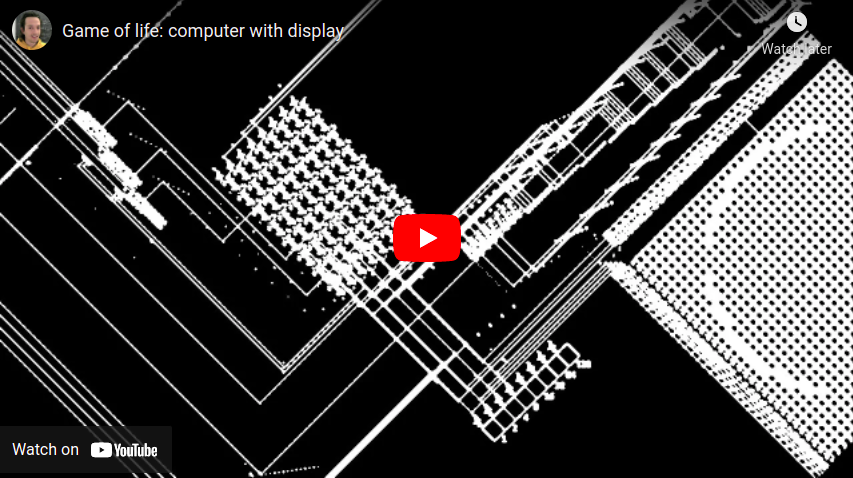
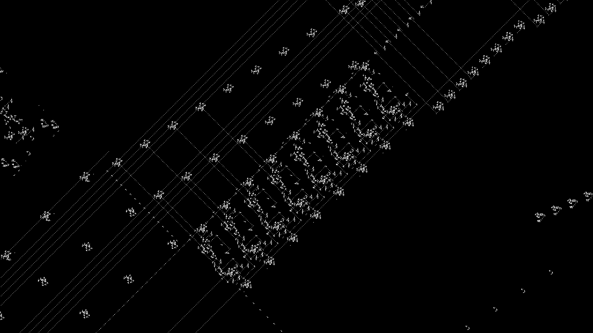
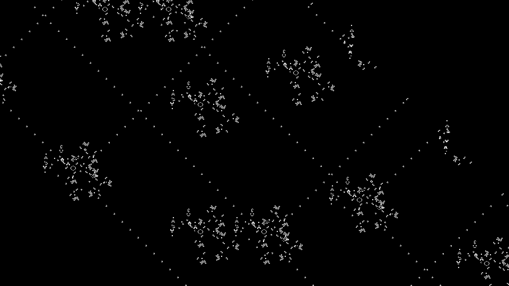

# Computer in Conway's game of life 

This is a computer built in Conway’s game of life.
It supports variable sizes of 8, 16 and 32 bit. Maximum program size: 256 lines, maximum number of variables: 128.

It can be programmed with the Golly cript assembly.py
Golly: http://golly.sourceforge.net/
programing instructions are in assembly.py

## Video
<a href="https://www.youtube.com/watch?v=WfuhbI8HE7s" target="_blank"></a>

## Usage
Open <a href="http://golly.sourceforge.net/">Golly</a>: "Files>Run script.." select assembly.py.
## Programming instructions
The pattern can be programmed to run your own algorithm by modifying the program variable in assembly.py

Variable names start by "a" followed by a number. eg a1 a2 a3 a10 are good variable names
a0 is used for storing the current program line, so be carefull, modifiying a0 will jump to the line a0
the instructions are:
```
(let be n an integer in base 10)
write a1 n
-> write n to the variable a1 (written in 2's complement if signed)

goto n
-> go to the line n (first line is line 0)

move a1 a2
-> a1=a2

jump a1
-> jump the a1 next lines

print a1
-> print a1

disp a1 a2
-> draw a pixel of coordinates a1 a2

erase
-> erase the 2d display

rfb a1 a2
-> a1 = memory[a2] ; write the content of the address stored in a2 to a1; (if a2=N, a1=aN)

wfb a1 a2
-> memory[a2] = a1 ; write a1 to the address stored in a2; (if a2=N, aN=a1)

++ a1 a2
-> a1=a2+1

- a1 a2 a3
-> a1 = a2-a3

+ a1 a2 a3
-> a1 = a2+a3

or a1 a2 a3
-> a1=bitwiseOR(a2,a3)

and a1 a2 a3
-> a1=bitwiseAND(a2,a3)

xor a1 a2 a3
-> a1=bitwiseXOR(a2,a3)

not a1 a2
-> a1=bitwiseNOT(a2)

>> a1 a2
-> a1 = shift_right(a2)

<< a1 a2
-> a1 = shift_left(a2)

rr a1 a2
-> a1 = rotate_right(a2)

rl a1 a2
-> a1 = rotate_left(a2)

=0 a1 a2
-> a1 = 1 if a2==0 else a1=0

!=0 a1 a2
-> a1 = 1 if a2!=0 else a1=0

less a1 a2
-> a1 = 1 if less_significant_bit(a2)==1 else a1=0

most a1 a2
-> a1 = 1 if most_significant_bit(a2)==1 else a1=0

*- a1 a2
-> a1 = -a2
```

The wollowing example will print Fibonacci sequence:
```

program = """
write a1 1
write a2 1
+ a1 a1 a2
print a1
+ a2 a1 a2
print a2
goto 2
"""
```


## Screenshots






